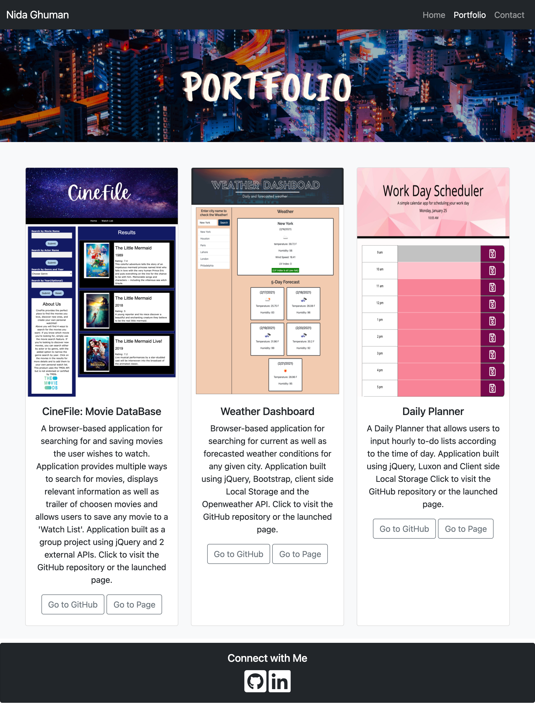
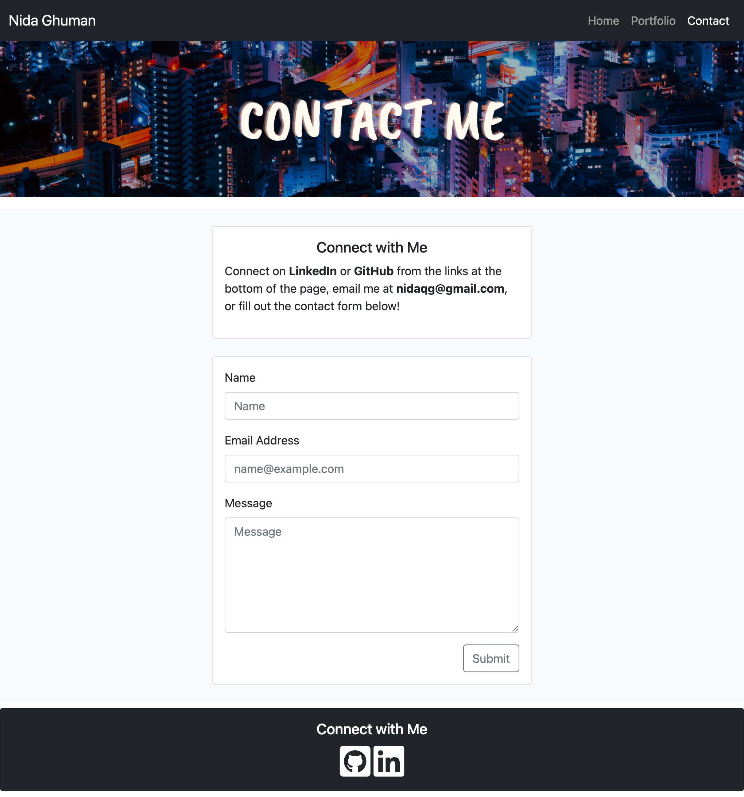

# responsive-portfolio
Responsive Portfolio built using Bootstrap

This project required the building of a responsive portfolio website by using Bootstrap and it's grid system. The portfolio had to have 3 functional pages: an 'About Me'/home page, a portfolio page and a contact page.

With the use of Bootstrap, I was able to create functional and responsive pages using rows, columns and cards as the base. Each page contains a navigation bar with links to each of the 3 pages as well as a footer with links to relevant social media.

The use of Bootstrap proved quite useful in the building of the webpage as it's predefined classes helped me achieve the visual look I was looking for without needing to add a separate CSS file. I also used Font Awesome to add social media icons to the footers. 

The following images show the UI of the finished website:

Find below a link to the GitHub repository for the project:
https://github.com/nidaqg/responsive-portfolio 

Find below a link to deployed project:
https://nidaqg.github.io/portfolio/

